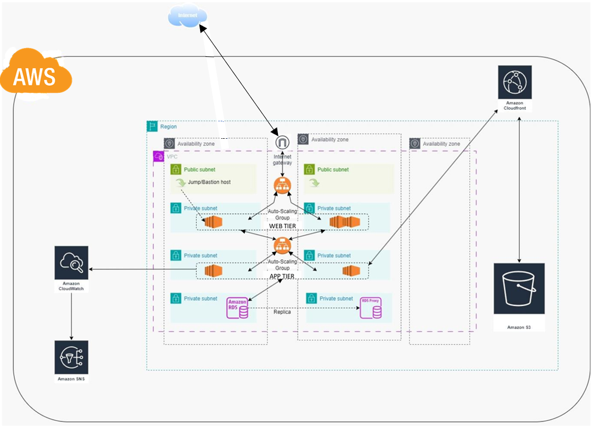
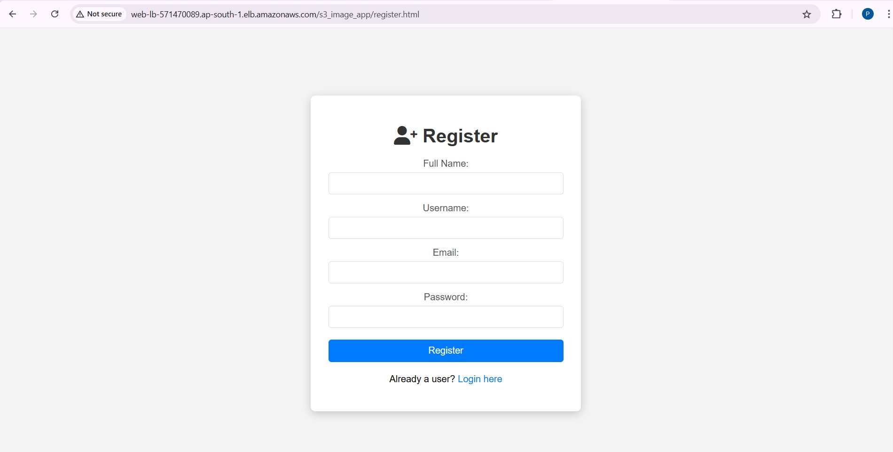
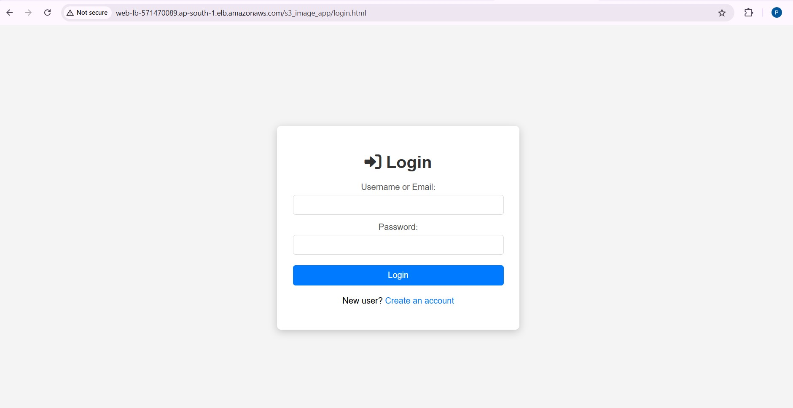
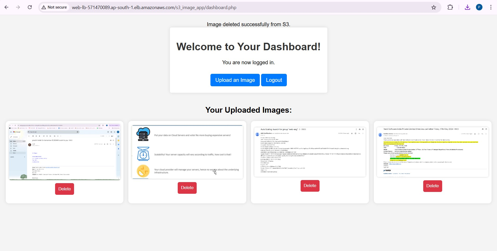
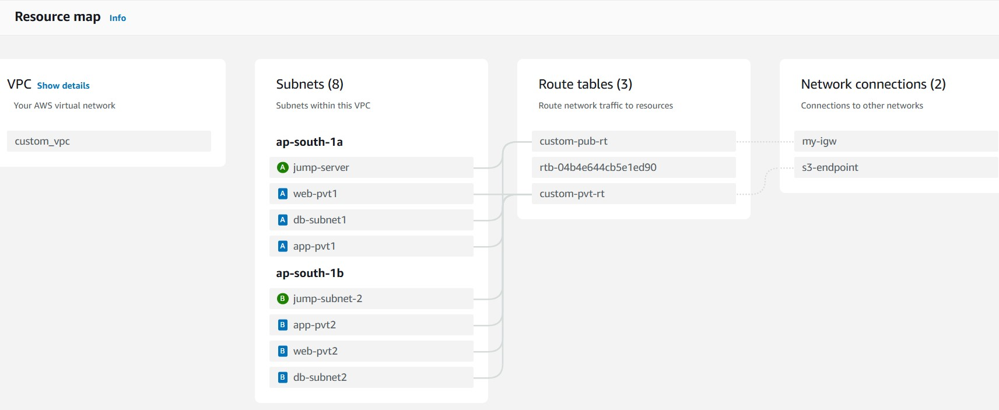
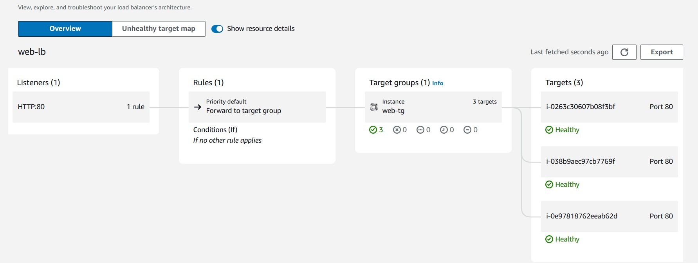
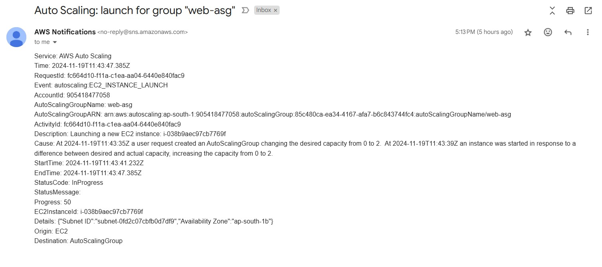

# IMAGE-STORE using AWS

This project is a web-based application where users can **register**, **log in**, **upload images**, and **view their uploaded images**. The application is deployed using **AWS services** in a 4-tier architecture, utilizing modern cloud technologies for scalability and performance.

## 🚀 Features

- User **Registration** and **Login**.
- Upload and store images securely on **Amazon S3**.
- View uploaded images after login.
- Deployed with **Nginx** as the web server.
- Utilizes **CloudFront** for content delivery.
- Secure and reliable database with **Amazon RDS (MySQL)**.

## 📂 Technologies Used

- **Web Server:** Nginx
- **Frontend:** HTML, CSS
- **Backend:** PHP
- **Database:** MySQL (Amazon RDS)
- **Storage:** Amazon S3
- **Cloud Platform:** AWS (EC2, RDS, S3, CloudFront, CloudWatch, SNS)
- **Operating System:** Amazon Linux 2023

## 🏗️ Architecture Overview

The application is deployed in a **4-tier AWS architecture**:

1. **Load Balancer:** Distributes traffic across multiple EC2 instances.
2. **Web Tier:** Built with **HTML/CSS** and served by **Nginx** on **Amazon Linux**.
3. **Application Tier:** A **PHP** application running on EC2.
4. **Database Tier:** Uses **Amazon RDS** with **MySQL** for user data.
5. **Storage and Delivery:**
   - **Amazon S3** for image storage.
   - **CloudFront** for global content delivery and caching.
6. **Monitoring and Alerts:**
   - **Amazon CloudWatch** for logging, monitoring, and metrics.
   - **Amazon SNS** for notifications in case of application or infrastructure issues.



## ⚙️ Setup Instructions

### Steps

1. **Clone the Repository**
   ```bash
   git clone https://github.com/your_username/your_repo.git
   cd your_repo
 
2. **Configure AWS**

- Set up S3 bucket and enable public access for images.
- Launch an EC2 instance with Amazon Linux.
- Set up RDS with a MySQL database.

3. **Deploy Code**

- Upload the application code to the EC2 instance.
- Configure Nginx to serve your application.
- Set up your PHP application to interact with S3 and RDS.

4. **CloudFront Configuration**

- Create a CloudFront distribution for your S3 bucket for CDN.

5. **Access the Application**

- Access your application using the public DNS of the EC2 instance or via CloudFront.

## 📸 Screenshots

- **Register Page**  
  

- **Login Page**  
  

- **Dashboard Page**  
  

- **Resource Map**  
  

- **Target Map**  
  

- **SNS Notification**  
  

## 🤝 Contribution

Contributions are welcome! Please open an issue or submit a pull request.

